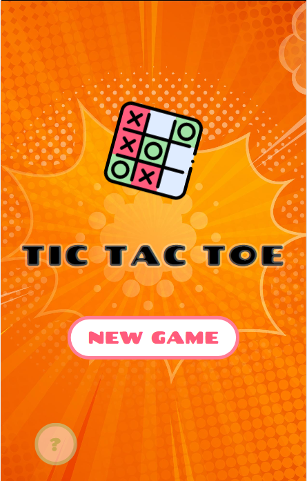
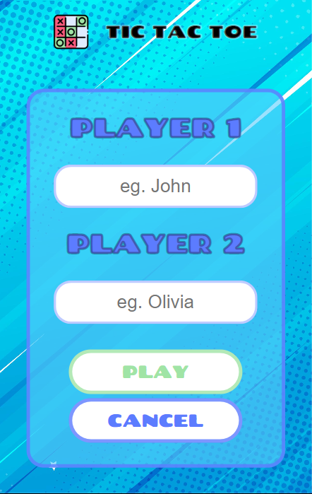
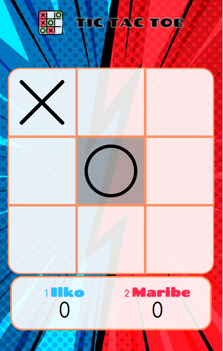

# Tic Tac Toe Game

The objective of this exercise is to create a program that allows us to play tic tac toe against a human opponent or against the cpu. After each move the program should display the board and allow the human to move.

``This project is the third technical test carried out within the scope of the FullStack Developer Bootcamp, held in Valencia, between January and March 2023.``

Screenshots (Nexus 5):

| Game start | Setup | Play board |
| ----------- | ----------- | ----------- |
|  |  |  |

URL: https://ilkogarcia.github.io/igp-btc-fsd-pry3-tictactoe/pages/tictactoe.html

## Table of Contents
1. [General info](#info)
2. [Technologies](#tech)
3. [Installation](#install)
4. [Credits & Acknowledgements](#credits)
5. [License Information](#license)

## <a name="info"></a>General info
To pass the test, the application must meet the following functional requirements:

RF1 - The user must be able to start a new game.
RF2 - When starting a new game a 3x3 board will be created with the default values.
RF3 - When starting a new game, a 3x3 board will always be created with the moves and a side panel with the information of the players and the game turn.
RF4 - The user can customize the name of the player only before starting each game as well as the type of player.
RF5 - The allowed player type combinations are: human-human, human-cpu, cpu-human.
RF6 - Each player can have a maximum of three tokens in play.
RF7 - If the six pieces are in play, the user must select a position occupied by his pieces to modify its position to a new position.
RF8 - You can only place tiles in free positions, remember to add a validator for this.

``Note: In its latest version, it is only possible to play between two people.``


## <a name="tech"></a>Technologies
Technologies used in the development of the application:

* [HTML5](https://developer.mozilla.org/en-US/docs/Glossary/HTML5)
* [CSS3](https://developer.mozilla.org/en-US/docs/Web/CSS)
* [SUIT CSS naming conventions](https://github.com/suitcss/suit/blob/master/doc/naming-conventions.md)

``Note: I have decided to use Nicolas Gallagher's SUIT CSS naming convention, which has a component-oriented approach and therefore provides us with better readability.``

## <a name="install"></a>Installation
To download the project and open it in your development environment follow the instructions below:

1. Open your browser and navigate to the folder where you want to clone the project.
2. Run Git Bash from that folder.
2. Clone the project. Use the following command line in the Git Bash console.
```
$ git clone https://github.com/ilkogarcia/igp-btc-fsd-pry3-tictactoe.git
```
3. From Git Bash, open the project in the development environment.. 
```
$ cd igp-btc-fsd-pry3-tictactoe
$code .
```
4. Happy coding!!!

#### Top-level directory layout
With the repository deployed on your local hard drive, you will have the following folder structure in your software project:
.
├── assets      # Assets files (eg. `.jpg`, `.png`, `.ico`)
├── css         # Stylesheets files
├── js          # Javascript files
├── pages       # Game pages
├── index.html  # Game home page
├── LICENSE
└── README

## <a name="credits"></a>Credits and Acknowledgements
The third-party assets used in this project and their license terms are credited below. 

1. <a href="https://www.flaticon.com/free-icons/tic-tac-toe" title="tic-tac-toe icons">Tic-tac-toe icons created by Freepik - Flaticon</a>

Additionally I take this opportunity to thank everyone who helped me develop the content found in this repository.

## <a name="license"></a>License information

This code is published under the <a href="https://opensource.org/licenses/MIT">MIT License</a>. The text of a license is stored in the LICENSE.txt file in the root of this project.